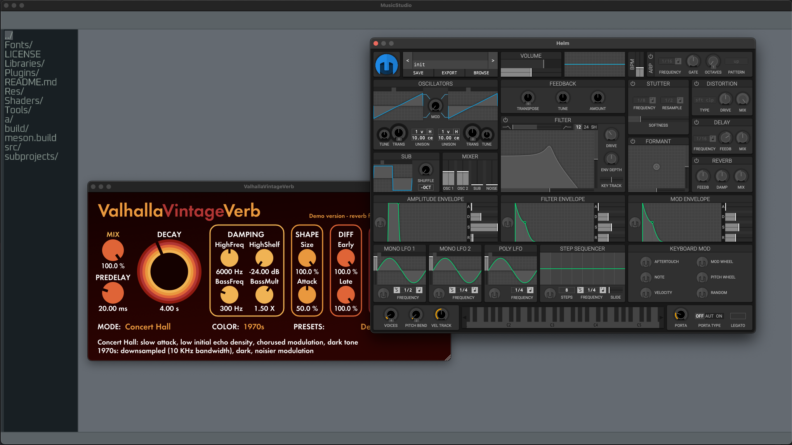

# MusicStudio

**MusicStudio** is a digital audio workstation.



## Build instructions

### Prerequisites:

When building with macOS, `glew` and `sdl2` needs to be installed.

### Setup:

```sh

meson build

```

### Build:

```sh

ninja -C build

```

### Run:

```sh

./build/src/music-studio

```
