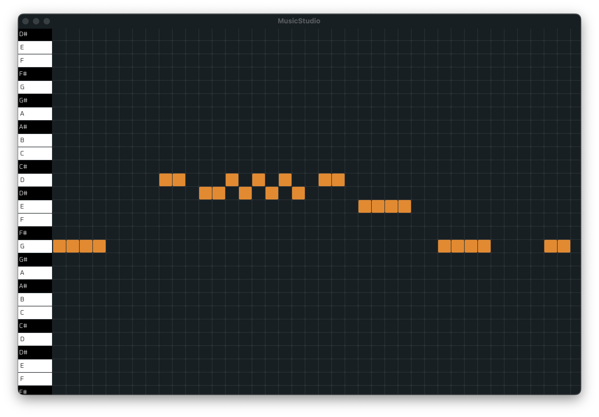

# The MusicStudio Project

A Digital Audio Workstation written from scratch.

## About

Roughly speaking, the goal of this project is to create DAW similar in look
and feel to FL Studio, since I've found myself very productive in it.
This is a system by us, for us, based on the things we like.

It currently only works on macOS.

# Screenshots

## Features

- [x] VST2 support
- [x] WASM plugins
- [x] Instant reloading of both ui and audio code

## Build instructions

This project is only tested to compile with the `clang` compiler on macOS.
You will need to install it, by running `xcode-select install` in the terminal
after which you will need to run the bootstrap command. This will build all the
software needed in the build process, which will take a while, so just grab the
beverage of your choice and enjoy the hum of your computer fans :)

### Prerequisites

    xcode-select install

### Setup: (bootstrap the toolchain)

    eval $(./bootstrap)

### Build: (this is the command to run when rebuilding)

    ninja -C build

After building, the MusicStudio executable will be found in `./build/bin/music-studio`.

## Goals

1. Reliability
2. Executable performance
3. Fast hot reload of all the things
4. Zero dependencies
4. Fun!

## Reliability

To make MusicStudio reliable, we try to keep ourselves to using the
NASA/JPL Rules for Developing Safety-Critical Code:

* Avoid complex flow constructs, such as goto and recursion.
* All loops must have fixed bounds. This prevents runaway code.
* Avoid heap memory allocation after initialization.
* Restrict functions to a single printed page.
* Use a minimum of two runtime assertions per function.
* Restrict the scope of data to the smallest possible.
* Check the return value of all non-void functions, or cast to void to indicate the return value is useless.
* Use the preprocessor only for header files and simple macros.
* Limit pointer use to a single dereference, and do not use function pointers.
* Compile with all possible warnings active; all warnings should then be addressed before release of the software.

## Fast hot reload of all the things

When tweaking UI/Audio algorithms, a tight feedback loop is required
for a great developer experience. Therefore, MusicStudio is built
from the ground up with code reloading in mind. This means that
there are a few things to keep in mind while writing code.

* Keep the structs and functions ABI stable, this means that if you
  add a field to a structure, it should probably be at the end, and
  we rarely remove fields at all. The `ty_trans_migrate()` macro will
  ensure that the new fields are initialized to zero when they've
  been added.

* Don't send (function) pointers between threads unless you're sure
  that the pointer would be valid after a code swap. Instead, send
  all the data to the other thread via `THMessageQueue`.

## Zero dependencies

MusicStudio wants to be a zero dependency program, everything should
be built in-house, since that way we can ensure that the code is real-time
safe and the full stack integration of the code base nicer and makes the
project easier to build. There are a couple exceptions to this rule,
namely STB libraries and (at the moment) [libsoundio](https://github.com/andrewrk/libsoundio).

